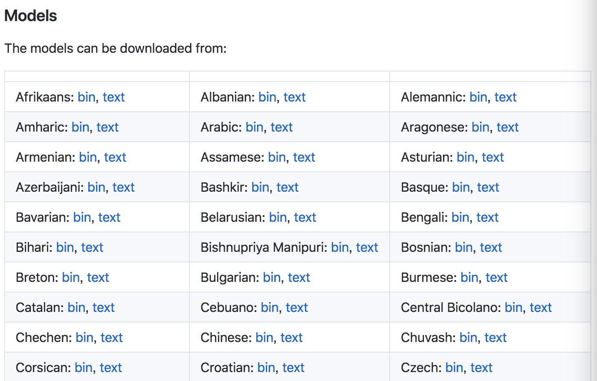
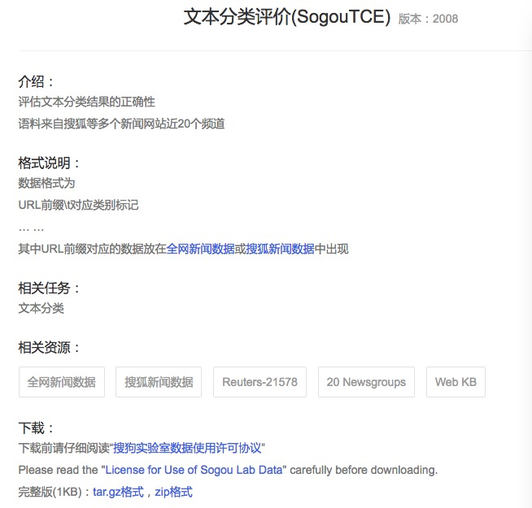

# fasttext原理
fasttext提供了一种有效且快速的方式生成词向量以及进行文档分类。
fasttext模型输入一个词的序列，输出这个词序列属于不同类别的概率。fasttext模型架构和Word2Vec中的CBOW模型很类似。不同之处在于，fasttext预测标签，而CBOW模型预测中间词。fasttext设计的初衷就是为了作为一个文档分类器，副产品是也生成了词向量。

# fasttext特性
## n-gram
在词袋模型中，把单词当做独立的个体，没有考虑词前后的关系。比如"我打你"和“你打我“，使用词袋模型的话，这两句话是完全一样的。
词袋的特征为：

	["我",“打“,”你”]
	
"我打你"和“你打我“对应的特征向量均为：

	[1,1,1]

n-gram是对词袋模型的一种改善，它会关注一个单词的前后关系，比如n-gram中最常见的2-gram，就关注单词的前一个词，比如"我打你",就可以拆分为"我打"和"打你"。这两句话一起建模的话，2-gram对应的特征为：

	["我打"，"打你"，"你打"，"打我"]

"我打你"对应的特征向量为：

	[1,1,0,0]

"你打我"对应的特征向量为：

	[0,0,1,1]

与Word2Vec使用词袋模型不同，fasttext使用了n-gram模型，因此fasttext可以更有效的表达词前后的之间的关系。
## 高效率
fasttext在使用标准多核CPU的情况下10分钟内处理超过10亿个词汇，特别是与深度模型对比，fastText能将训练时间由数天缩短到几秒钟。使用一个标准多核CPU，得到了在10分钟内训练完超过10亿词汇量模型的结果。

# 安装fasttext
fasttext的安装非常简便，直接从github上同步最新的代码并进行安装即可。

	$ git clone https://github.com/facebookresearch/fastText.git
	$ cd fastText
	$ pip install .

# 预训练模型
facebook已经基于其收集的海量语料，训练好了fasttext的词向量模型，目前已经支持了150多种语言。有需要的读者可以直接下载并使用，对应的链接为：

	https://github.com/facebookresearch/fastText/blob/master/docs/crawl-vectors.md
	

# 数据集
数据集依然使用搜狗实验室提供的"搜狐新闻数据"，该数据来自搜狐新闻2012年6月—7月期间国内，国际，体育，社会，娱乐等18个频道的新闻数据，提供URL和正文信息。
对应的网址为：

	http://www.sogou.com/labs/resource/cs.php

数据文件的格式为：
	<doc>
	
	<url>页面URL</url>
	
	<docno>页面ID</docno>
	
	<contenttitle>页面标题</contenttitle>
	
	<content>页面内容</content>
	
	</doc>
	
我们可以看到数据文件中并没有标记页面内容属于哪个频道，如果需要做文档分类，搜狗提供了页面URL和频道之间的映射关系。

下载SogouTCE文件，可以看到具体的映射关系举例如下：

	http://www.xinhuanet.com/auto/	汽车
	http://www.xinhuanet.com/fortune	财经
	http://www.xinhuanet.com/internet/	IT
	http://www.xinhuanet.com/health/	健康
	http://www.xinhuanet.com/sports	体育
	http://www.xinhuanet.com/travel	旅游
	http://www.xinhuanet.com/edu	教育
	http://www.xinhuanet.com/employment	招聘
	http://www.xinhuanet.com/life	文化
	http://www.xinhuanet.com/mil	军事
	http://www.xinhuanet.com/olympics/	奥运
	http://www.xinhuanet.com/society	社会

# 数据清洗
搜狐新闻数据的文件默认编码格式为gb18030，因此解压缩后要线转换成utf-8格式。

	tar -zxvf news_sohusite_xml.full.tar.gz
	cat news_sohusite_xml.dat | iconv -f gb18030 -t utf-8 > news_sohusite_xml-utf8.txt
	
转换完格式后查看文件内容，文件以xml形式记录，举例如下：

	<doc>
	<url>http://gongyi.sohu.com/s2008/sourceoflife/</url>
	<docno>f2467af22cd2f0ea-34913306c0bb3300</docno>
	<contenttitle>中国西部是地球上主要干旱带之一，妇女是当地劳动力．．．</contenttitle>
	<content>同心县地处宁夏中部干旱带的核心区，　冬寒长，春暖迟，夏热短，秋凉早，干旱少雨，蒸发强烈，风大沙多。主要自然灾害有沙尘暴、干热风、霜冻、冰雹等，其中以干旱危害最为严重。由于生态环境的极度恶劣，导致农村经济发展缓慢，人民群众生产、生活水平低下，靠天吃饭的被动局
	面依然存在，同心，又是国家级老、少、边、穷县之一…［详细］</content>
	</doc>

但是数据文件并不是标准的xml格式，如下所示，该文件相对标准的xml格式缺少了根元素。

	<doc>
	    <url></url>
	    <docno></docno>
	    <contenttitle></contenttitle>
	    <content></content>
	</doc>
	<doc>
	    <url></url>
	    <docno></docno>
	    <contenttitle></contenttitle>
	    <content></content>
	</doc>

所有的doc节点都直接是最顶层，没有根节点。因此要添加根节点使该文本文件符合xml文件的规范，最简单的一种形式就是在文件的开始和结尾添加根元素标签。

	<?xml version="1.0" encoding="utf-8"?>
	<docs>
		<doc>
		    <url></url>
		    <docno></docno>
		    <contenttitle></contenttitle>
		    <content></content>
		</doc>
		<doc>
		    <url></url>
		    <docno></docno>
		    <contenttitle></contenttitle>
		    <content></content>
		</doc>
	</docs>

可以直接使用文本编辑工具在数据文件的开始和结尾进行修改，但是这有可能导致你的终端因为内存使用过大而崩溃。一种比较稳妥的做法是使用程序完成。

	def make_xml():
		print "<?xml version=\"1.0\" encoding=\"utf-8\"?>"
	    print "<docs>"
	    with open("data/news_sohusite_xml-utf8.txt") as F:
	        for line in F:
	            print line
	        F.close()
	    print "</docs>"
	    
在终端执行该程序，并将标准输出的结果保存即可，剩下的操作只要解析xml文件即可。下面我们介绍另一种方法，观察可以发现，url和content是成对出现的，并且一一对应。我们可以过滤这两个字段的内容，分别保存成content文件和url文件。
首先过滤出url字段的内容，并且删除掉url标签。

	cat news_sohusite_xml-utf8.txt | grep '<url>' | sed  's/<url>//g' | sed  's/<\/url>//g' > news_sohusite_url.txt
	
然后过滤出content字段的内容，并且删除掉content标签。

	cat news_sohusite_xml-utf8.txt | grep '<content>' | sed  's/<content>//g' | sed  's/<\/content>//g' > news_sohusite_content.txt

content是中文内容，需要使用jieba进行切词，可以把切词的动作也放到上面的命令里面。

	cat news_sohusite_xml-utf8.txt | grep '<content>' | sed  's/<content>//g' | sed  's/<\/content>//g' | python -m jieba -d ' '  > news_sohusite_content.txt

加载url和对应领域的映射关系的文件，以哈希的形式保存对应的映射关系。

	def load_SogouTCE():
	    SogouTCE=[]
	    SogouTCE_kv = {}
	    with open("../data/SogouTCE.txt") as F:
	        for line in F:
	            (url,channel)=line.split()
	            SogouTCE.append(url)
	        F.close()
	    for index,url in enumerate(SogouTCE):
	        #删除http前缀
	        url=re.sub('http://','',url)
	        print "k:%s v:%d" % (url,index)
	        SogouTCE_kv[url]=index
	    return  SogouTCE_kv
	    
我们分析下各个领域的数据分布情况，把匹配上的url对应的标记打印出来。

	def load_url(SogouTCE_kv):
	    labels=[]
	    with open("../data/news_sohusite_url.txt") as F:
	        for line in F:
	            for k,v in SogouTCE_kv.items():
	                if re.search(k,line,re.IGNORECASE):
	                    #print "x:%s y:%d" % (line,v)
	                    print v
	                    labels.append(v)
	        F.close()
	    return  labels
	   
运行程序，分析各个领域对应的url数量。

	python fasttext.py > v.txt
	cat v.txt | sort -n | uniq -c

每行的第一个字段是数量，第二个字段是对应的领域的id，结果表明搜狐新闻数据集中在某几个领域，并且分布不均匀。为了避免样本不均衡导致的误判，我们选择数量上占前三的领域作为后继分析的数据，id分别为81，79和91。

	138576 79
	27489 80
	199871 81
	23409 82
	44537 83
	2179 84
	13012 85
	1924 87
	3294 88
	 842 89
	50138 91
	5882 92

反查对应的url为：

	kit.sohu.com/ id:81
	auto.sohu.com/ id:79
	yule.sohu.com/ id:91
	
过滤我们关注的领域的内容，将content保存在x列表里，对应的领域的id保存在y列表里，作为标签使用，至此我们完成了数据清洗的工作。

	def load_selecteddata(SogouTCE_kv):
	    x=[]
	    y=[]
	
	    #加载content列表
	    with open("../data/news_sohusite_content.txt") as F:
	        content=F.readlines()
	        F.close()
	
	    # 加载url列表
	    with open("../data/news_sohusite_url.txt") as F:
	        url = F.readlines()
	        F.close()
	
	    for index,u in  enumerate(url):
	        for k, v in SogouTCE_kv.items():
	            # 只加载id为81，79和91的数据
	            if re.search(k, u, re.IGNORECASE) and v in (81, 79, 91):
	                #保存url对应的content内容
	                x.append(content[index])
	                y.append(v)
	
	    return x,y
	   
## 删除停用词
在处理中文语料时，需要删除停用词。所谓停用词就是对理解中文含义没有明显作用的哪些单词，常见的停用词举例如下：

	一一  
	一下  
	一个  
	一些  
	一何  
	一切  
	一则  
	一则通过  
	一天  
	一定  
	一方面  
	一旦  
	一时 

另外所有的字母和数字还有标点符号也可以作为停用词。我们把停用词保存在一个文本文件里面便于配置使用。
定义加载停用词的函数。

	def load_stopwords():
	    with open("stopwords.txt") as F:
	        stopwords=F.readlines()
	        F.close()
	    return [word.strip() for word in stopwords]
	    
使用停用词过滤之前提取的文本内容。

    stopwords=load_stopwords()

    #切割token
    x=[  [word for word in line.split() if word not in stopwords]   for line in x]
    
# 文档分类
## 数据文件格式
fasttext对训练和测试的数据格式有一定的要求，数据文件和标签文件要合并到一个文件里面。文件中的每一行代表一条记录，同时每条记录的最后标记对应的标签。默认情况下标签要以\_\_label\_\_开头,比如：

	这是一条测试数据	__label__1
python下实现合并数据文件和标签文件的功能非常简单。

	def dump_file(x,y,filename):
	    with open(filename, 'w') as f:
	        for i,v in enumerate(x):
	            line="%s __label__%d\n" % (v,y[i])
	            f.write(line)
	        f.close()
	        
加载数据清洗后的数据和标签，随机划分成训练数据和测试数据，其中测试数据占20%。

	SogouTCE_kv=load_SogouTCE()
	x,y=load_selecteddata(SogouTCE_kv)
	# 分割训练集和测试集
	x_train, x_test, y_train, y_test = train_test_split(x, y, test_size=0.2)
	
按照fasttext的格式要求保存成训练数据和测试数据。

    #按照fasttest的要求生成训练数据和测试数据
    dump_file(x_train,y_train,"../data/sougou_train.txt")
    dump_file(x_test, y_test, "../data/sougou_test.txt")
    
查看训练数据文件的内容，举例如下：

	２ ０ １ ２ 款 长安 标致 雪铁龙 Ｄ Ｓ ４ ／ Ｄ Ｓ ５ 九寨沟 试驾 __label__79
	 
## 训练模型
下面开始训练fasttext模型。

	# train_supervised uses the same arguments and defaults as the fastText cli
	model = train_supervised(
	        input="../data/sougou_train.txt", epoch=25, lr=0.6, wordNgrams=2, verbose=2, minCount=1
	    )

其中比较重要的几个参数的含义为：

- input；表示训练数据文件的路径
- epoch：表示训练的次数
- lr：表示初始的学习速率
- wordNgrams：表示n-gram的值，一般使用2，表示2-gram
- minCount：表示参与计算的单词的最小出现次数。

## 验证效果
fasttext默认情况下会计算对应的准确率和召回率。

	def print_results(N, p, r):
	    print("N\t" + str(N))
	    print("P@{}\t{:.3f}".format(1, p))
	    print("R@{}\t{:.3f}".format(1, r))
	    
使用测试数据文件进行校验。

	print_results(*model.test("../data/sougou_test.txt"))
	
运行程序，显示加载了36M的单词，其中包含288770的单词组合，标记类型一共3种。

	Read 36M words
	Number of words:  288770
	Number of labels: 3

验证效果如下所示，准确率为99.0%，召回率为99.0%，对应的F1计算为99.0%，效果非常不错。

	Progress: 100.0% words/sec/thread:  626183 lr:  0.000000 loss:  0.005640 ETA:   0h 0m 
	N	71107
	P@1	0.990
	R@1	0.990
